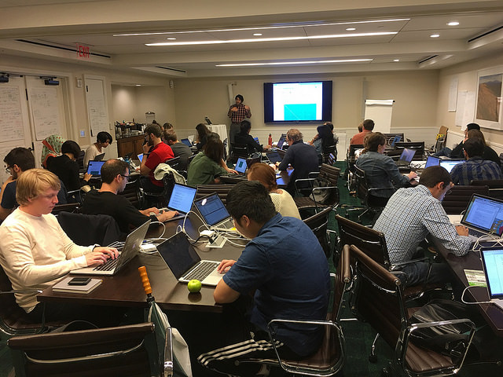

				<section id="mind2017_banner">
				    

				        
Methods in Neuroscience at Dartmouth Computational Summer School

				        
Multiscale Network Dynamics

				        
/p>
				    

				</section>

## 2017 Methods in Neuroscience at Dartmouth Computational Summer School
### Multiscale Network Dynamics (8/13 - 8/20/2017)

{:margin: 15px 0px 0px 15px: height="36px" width="36px"}

There is a growing gap between how graduate students in psychology and neuroscience are trained and what they actually need to know to do cutting edge work.  We see two fundamental issues driving this gap. First, most training programs do not expose students to the latest computational tools.  Second, an even greater challenge is to supplement the traditional reductionist approach to studying the elements of brain, cognition, and behavior in isolation, to integrating how these elements interact as a cohesive complex system.  This entails considering not just which elements in a network interact, but also the content of the interaction, and the dynamics of how this information flows through the network over time.  This general issue is present in multiple domains, with an accompanying need for similar tools: <strong>neurophysiologists</strong> studying spiking activity in ensembles of single neurons, <strong>cognitive neuroscientists</strong> studying whole-brain activity levels, and <strong>social psychologists</strong> studying group interactions. The focus of the 2017 MIND summer program was on understanding <strong>network dynamics at multiple scales</strong>, from circuit, whole-brain, and social network levels.

The overall format of the summer school included short lectures in the morning, followed by hands-on tutorial-style labs, and a hackathon in which students collaboratively worked on projects with faculty in informal "Pop Up Labs".

Themes running through the curriculum include open tools and data, data visualization, statistical modeling, and model comparison.

### Pop Up Labs

A major focus of the summer school is hands on training with cutting edge computational techniques.

In such a short amount of time, we have found that working in informal "Pop Up Labs" to be a highly effective and fun way to learn new techniques.

In this format, participants work collaboratively with course faculty and teaching assistants to develop a research project that answers a question relevant to the course topic using publically available data.

This setting is a highly efficient way for the summer participants to learn from each other and receive active mentorship from course faculty on actual data analysis.

This ensures that the techniques are learned in an applied context and this knowledge can more easily be shared upon returning to their home institutions.

								
								
								 

### Course Materials
We have done our best to make all of the course materials publically available. Lectures can be viewed on our [youtube channel](https://www.youtube.com/channel/UCFiU9ZsUybQPq14MgvZJZSQ). The majority of the hands on tutorials are available on our [github page](https://github.com/Summer-MIND/mind_2017). All accompanying data is also publically available. The software stack for all of the tutorials is available in our [docker container](https://github.com/Summer-MIND/mind-tools) (Note: Matlab requires a license key).

See our schedule below for links to specic topics.

								 
								<h3>2017 Participants</h3>
								
								
Yoni Ashar,
								Iva Brunec,
								Shannon Burns,
								Jin Cheong,
								Sherry Chien,
								Samantha Cohen,
								Rose Cooper,
								Rebecca Cutler,
								Elizabeth DuPre,
								Steven Greening,
								Nathaniel Haines,
								Aaron Heller,
								Siti Ikhsan,
								Eshin Jolly,
								Seth Koslov,
								Yuan Chang Leong,
								Grace Leslie,
								Yunzhe Liu,
								Feilong Ma,
								Lisa Musz,
								Gina Notaro,
								Anuya Patil,
								Rui Pei,
								Kristina Rapuano,
								Harrison Ritz,
								Beau Sievers,
								Ben Smith,
								Ryan Stolier,
								Youki Tanaka,
								Vincent Taschereau-Dumouchel,
								Mark Thornton,
								Matteo Visconti di Oleggio Castello,
								Mai-Anh Vu,
								Kirsten Ziman
								

								</section>
						

				</section>

				<!-- Two -->

					<a name="schedule"><section class="wrapper style2 container special"></a>
						<header>
							<h2>Schedule</h2>
						</header>
						

							

								<section>
									<header>
										<h3>1 | Computing Stack</h3>
									</header>
									<ul>
										<li>
Scientific Computing [<a href="https://youtu.be/p1eT0kleeJs">video</a>][<a href="https://github.com/Summer-MIND/mind_2017/blob/master/Lectures/Chang_ScientificComputing_MIND2017.pdf">slides</a>]
</li>
										<li>
Containers [<a href="https://github.com/Summer-MIND/mind-tools">code</a>]
</li>
										<li>
Jupyter Notebooks [<a href="https://youtu.be/gofxewOS9Gg">video</a>][<a href="http://nbviewer.jupyter.org/format/slides/github/dartmouth-brainhack-2017/IntroToJupyter/blob/master/Intro_To_Jupyter_Notebooks.ipynb#/">slides</a>][<a href="https://github.com/dartmouth-brainhack-2017/IntroToJupyter/tree/9a2cca0a88b837745430b234a3002ba6165ed6ce">code</a>]
</li>
										<li>
Hypertools [<a href="https://youtu.be/hb_ER9RGtOM">video</a>][<a href="https://github.com/Summer-MIND/mind_2017/blob/master/Lectures/hypertools.pdf">slides</a>][<a href="http://hypertools.readthedocs.io/en/latest/">code</a>]
</li>
									</ul>
								</section>
							

						

							<section>
								<header>
									<h3>2 | Project Brainstorming</h3>
								</header>
								<ul>
									<li>
High Performance Computing [<a href="https://github.com/Summer-MIND/mind_2017/blob/master/Lectures/Hudson_Discovery_MIND2017.pdf">slides</a>]
</li>
									<li>
Howard Eichenbaum Tribute [<a href="https://youtu.be/BcbYFMZo3Ls">video</a>][<a href="https://github.com/Summer-MIND/mind_2017/blob/master/Lectures/vandermeer_kemere_eichenbaum_MIND2017.pdf">slides</a>]
</li>
							</section>
						

            

							<section>
								<header>
									<h3>3 | Modeling Basics</h3>
								</header>
								<ul>
									<li>
Topographic Latent Source Analysis [<a href="https://youtu.be/tHCngESj_k0">video</a>][<a href="https://github.com/sjgershm/tlsa_matlab">code</a>]
</li>
									<li>
Model Fitting [<a href="https://youtu.be/dBTeIBwNoWo">video</a>]
</li>
									<li>
Reinforcement Learning [<a href="https://youtu.be/Nb2Lj8OgC-0">video</a>][<a href="https://github.com/Summer-MIND/mind_2017/tree/master/Tutorials/decision_learning">code</a>]
</li>
								</ul>
							</section>
						

						

							<section>
								<header>
									<h3>4 | Decoding  </h3>
								</header>
								<ul>
									<li>
Hyperalignment [<a href="https://youtu.be/HEEpEHnyn38">video</a>][<a href="https://github.com/Summer-MIND/mind_2017/blob/master/Tutorials/hyperalignment/hyperalignment_tutorial.ipynb">code</a>]
</li>
									<li>
fMRI Decoding [<a href="https://youtu.be/_c5zN3_MIgE">video</a>][<a href="https://github.com/Summer-MIND/mind_2017/blob/master/Lectures/Chang_Decoding_MIND2017.pdf">slides</a>][<a href="https://github.com/Summer-MIND/mind_2017/blob/master/Tutorials/Decoding/Chang_Decoding.ipynb">code</a>]
</li>
									<li>
Spike Decoding [<a href="https://youtu.be/6nJEXSHvLkg">video</a>][<a href="https://github.com/Summer-MIND/mind_2017/tree/master/Tutorials/SpikeDecoding">code</a>]
</li>
								</ul>
							</section>
						

					

				  

						

							<section>
								<header>
									<h3>5 | Network Basics</h3>
								</header>
									<ul>
										<li>
Timescales [<a href="https://youtu.be/g6usHtMo7Fs">video</a>][<a href="https://github.com/Summer-MIND/mind_2017/blob/master/Tutorials/TimescalesTutorial/TimescalesTutorial.ipynb">code</a>]
</li>
										<li>
Shared Memory [<a href="https://youtu.be/OwTsjN1b4fw">video</a>]
</li>
										<li>
Successor Representations [<a href="https://youtu.be/9n1Scm2ZOuw">video</a>]
</li>
								</ul>
							</section>
						

						

							<section>
								<header>
									<h3>6 | Connectivity</h3>
								</header>
								<ul>
									<li>
Social Connection [<a href="https://youtu.be/ujd1_okeQVw">video</a>]
</li>
									<li>
Functional Connectivity [<a href="https://youtu.be/CMOQgQmynkw">video</a>][<a href="https://github.com/cgratton/DartmouthMIND_tutorial">code</a>]
</li>
									<li>
Social Networks [<a href="https://youtu.be/-1cVS8fxRfg">video</a>]
</li>
								</ul>
							</section>
						

            

							<section>
								<header>
									<h3>7 | Dynamics  </h3>
								</header>
								<ul>
									<li>
Hidden Markov Models [<a href="https://youtu.be/PPXVTu5sbE0">video</a>][<a href="https://github.com/Summer-MIND/mind_2017/blob/master/Tutorials/HMM/HiddenMarkovModels.ipynb">code</a>]
</li>
									<li>
Topographic Factor Analysis [<a href="https://www.youtube.com/watch?v=DvzfPsOMvOw&t=3s">video</a>][<a href="https://github.com/Summer-MIND/mind_2017/blob/master/Lectures/htfa_MIND.pdf">slides</a>][<a href="https://github.com/Summer-MIND/mind_2017/blob/master/Tutorials/fMRI_NetworkDynamics/htfa_tutorial.ipynb">code</a>]
</li>
								</ul>
							</section>
						

						

							<section>
								<header>
									<h3>8 | Presentations</h3>
								</header>
							</section>
						

						

					</section>

				<!-- Three -->
					<a name="faculty"><section class="wrapper style3 container special"></a>

						<header class="major">
							<h2>Faculty</h2>
						</header>

						

							

								<section>
									
									<header>
										<h3 class='affiliation'><a href="http://www.princeton.edu/~chrisb/">Chris <strong>Baldassano</strong></a></h3>
										<h4 class='affiliation'>Princeton University</h4>
									</header>
								</section>
							

							

								<section>
									
									<header>
                                        <h3 class='affiliation'><a href="http://cosanlab.com/">Luke <strong>Chang</strong></a></h3>
										<h4 class='affiliation'>Dartmouth College</h4>
									</header>
								</section>
							

							

								<section>
									
									<header>
                                        <h3 class='affiliation'><a href="http://jchenlab.johnshopkins.edu/">Janice <strong>Chen</strong></a></h3>
										<h4 class='affiliation'>Johns Hopkins University</h4>
									</header>
								</section>

							

						

						

							

								<section>
									
									<header>
                                        <h3 class='affiliation'><a href="https://www.bu.edu/psych/faculty/hbe/">Howard <strong>Eichenbaum</strong></a></h3>
										<h4 class='affiliation'>Boston University</h4>
									</header>
								</section>
							

							

								<section>
									
									<header>
                                        <h3 class='affiliation'><a href="http://gershmanlab.webfactional.com/">Sam <strong>Gershman</strong></a></h3>
										<h4 class='affiliation'>Harvard University</h4>
									</header>
								</section>
							

							

								<section>
									
									<header>
																				<h3 class='affiliation'><a href="https://sites.google.com/site/caterinagratton/">Caterina <strong>Gratton</strong></a></h3>
										<h4 class='affiliation'>Washington University</h4>
									</header>
								</section>
							

						

							

								<section>
									
									<header>
                                        <h3 class='affiliation'><a href="http://www.onerussian.com/">Yaroslav <strong>Halchenko</strong></a></h3>
										<h4 class='affiliation'>Dartmouth College</h4>
									</header>
								</section>
							

							

								<section>
									
									<header>
										<h3 class='affiliation'><a href="http://haxbylab.dartmouth.edu/">James <strong>Haxby</strong></a></h3>
										<h4 class='affiliation'>Dartmouth College</h4>
									</header>
								</section>
							

							

								<section>
									
									<header>
																				<h3 class='affiliation'><a href="https://www.honeylab.org/">Christoher <strong>Honey</strong></a></h3>
										<h4 class='affiliation'>Johns Hopkins University</h4>
									</header>
								</section>
							

						

							

								<section>
									
									<header>
										<h3 class='affiliation'><a href="http://rnel.rice.edu/">Caleb <strong>Kemere</strong></a></h3>
										<h4 class='affiliation'>Rice University</h4>
									</header>
								</section>
							

							

								<section>
									
									<header>
										<h3 class='affiliation'><a href="http://www.context-lab.com/">Jeremy <strong>Manning</strong></a></h3>
										<h4 class='affiliation'>Dartmouth College</h4>
									</header>
								</section>
							

							

								<section>
									
									<header>
										<h3 class='affiliation'><a href="https://www.momen-nejad.org/">Ida <strong>Momennejad</strong></a></h3>
										<h4 class='affiliation'>Princeton University</h4>
									</header>
								</section>
							

	

							

								<section>
									
									<header>
										<h3 class='affiliation'><a href="http://sites.dartmouth.edu/ccnl/">Alireza <strong>Soltani</strong></a></h3>
										<h4 class='affiliation'>Dartmouth College</h4>
									</header>
								</section>
							

							

								<section>
									
									<header>
										<h3 class='affiliation'><a href="http://www.vandermeerlab.org/">Matthijs <strong>van der Meer</strong></a></h3>
										<h4 class='affiliation'>Dartmouth College</h4>
									</header>
								</section>
							

							

								<section>
									
									<header>
										<h3 class='affiliation'><a href="http://www.context-lab.com/">Thalia <strong>Wheatley</strong></a></h3>
										<h4 class='affiliation'>Dartmouth College</h4>
									</header>
								</section>
							

						

						<footer class="major">
							<ul class="buttons">
								<li><a href="#" class="button">Back to the top</a></li>
							</ul>
						</footer>

					</section>

			</article>

        <!-- Three -->
					<a name="organizers"><section class="wrapper style3 container special"></a>

						<header class="major">
							<h2>Organizing committee</h2>
						</header>

						

							

								<section>
									
									<header>
                                        <h3 class='affiliation'><a href="http://cosanlab.com/">Luke <strong>Chang</strong></a></h3>
										<h4 class='affiliation'>Dartmouth College</h4>
									</header>
								</section>
							

							

								<section>
									
									<header>
                                        <h3 class='affiliation'><a href="http://www.context-lab.com/">Jeremy <strong>Manning</strong></a></h3>
										<h4 class='affiliation'>Dartmouth College</h4>
									</header>
								</section>
							

                            

								<section>
									
									<header>
										<h3 class='affiliation'><a href="http://www.vandermeerlab.org/">Matthijs <strong>van der Meer</strong></a></h3>
										<h4 class='affiliation'>Dartmouth College</h4>
									</header>
								</section>
							

                            

								<section>
									
									<header>
										<h3 class='affiliation'><a href="http://sites.dartmouth.edu/thlab/people/courtney-rogers/">Courtney <strong>Rogers</strong></a></h3>
										<h4 class='affiliation'>Dartmouth College</h4>
									</header>
								</section>
							

						

                        <header class="major">
							<a name="executives"><h2>Advisory board</h2></a>
						</header>

                        

							

								<section>
									
									<header>
										<h3 class='affiliation'><a href="http://haxbylab.dartmouth.edu/">James <strong>Haxby</strong></a></h3>
										<h4 class='affiliation'>Dartmouth College</h4>
									</header>
								</section>
							

                            

								<section>
									
									<header>
										<h3 class='affiliation'><a href="http://www.dartmouth.edu/~heath/index.html">Todd <strong>Heatherton</strong></a></h3>
										<h4 class='affiliation'>Dartmouth College</h4>
									</header>
								</section>
							

                            

								<section>
									
									<header>
										<h3 class='affiliation'><a href="http://www.cs.dartmouth.edu/~rockmore/">Dan <strong>Rockmore</strong></a></h3>
										<h4 class='affiliation'>Dartmouth College</h4>
									</header>
								</section>
							

                            

								<section>
									
									<header>
										<h3 class='affiliation'><a href="http://www.context-lab.com/">Thalia <strong>Wheatley</strong></a></h3>
										<h4 class='affiliation'>Dartmouth College</h4>
									</header>
								</section>
							

						

                        <footer class="major">
							<ul class="buttons">
								<li><a href="#" class="button">Back to the top</a></li>
							</ul>
						</footer>
            </section>
